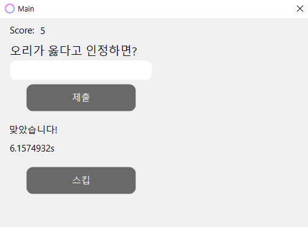
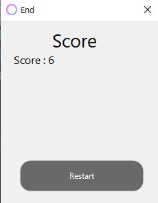

# AjeGag
본격 아재 양성 프로젝트  

## 사용법
1. 프로그램을 실행하면 나오는 문제들을 풀어보세요! (시간에 따라 문제를 풀면 얻는 점수가 달라집니다.)
2. 문제가 너무 어려우신가요? 그러면 스킵 버튼을 눌러 -5점을 얻어 문제를 스킵해보세요!

## Preview
  
  

## 아재 측정법
<b>0 이하 : 청정수  
0 ~ 15 : 일반인  
16 ~ 50 : 꽤 아재  
51 ~ 100 : 아재  
100 ~ 150 : 아재 이상의 존재  
150 이상 : ..... </b>